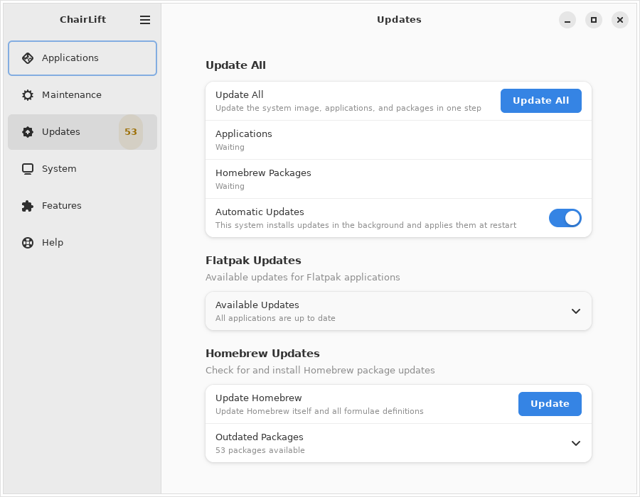
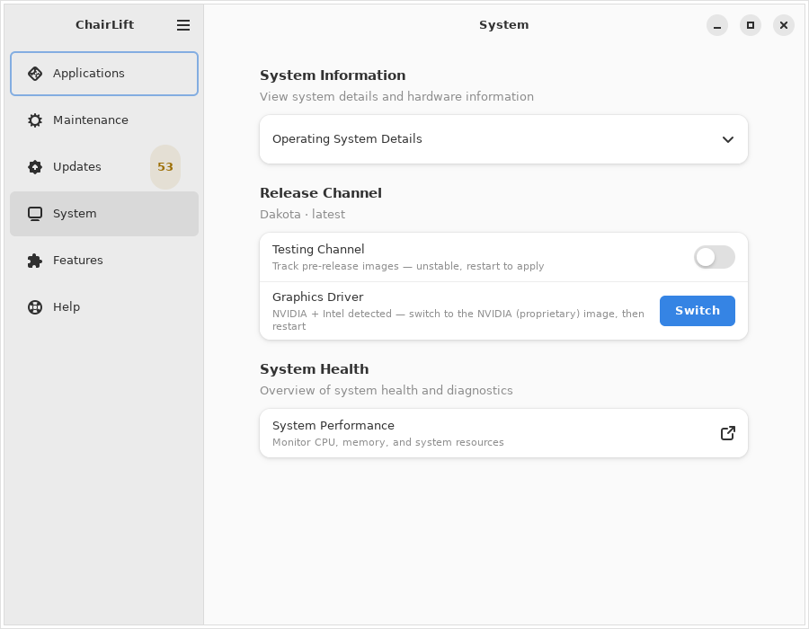
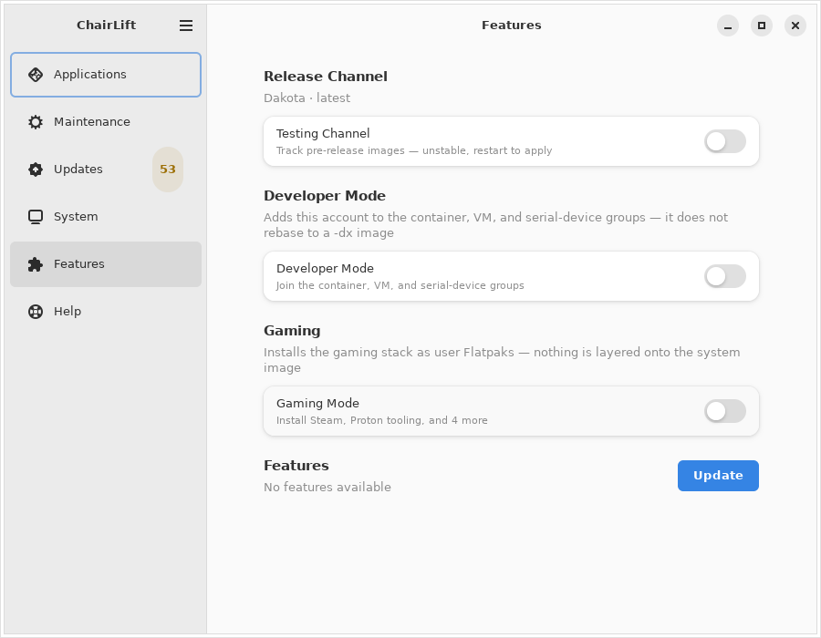
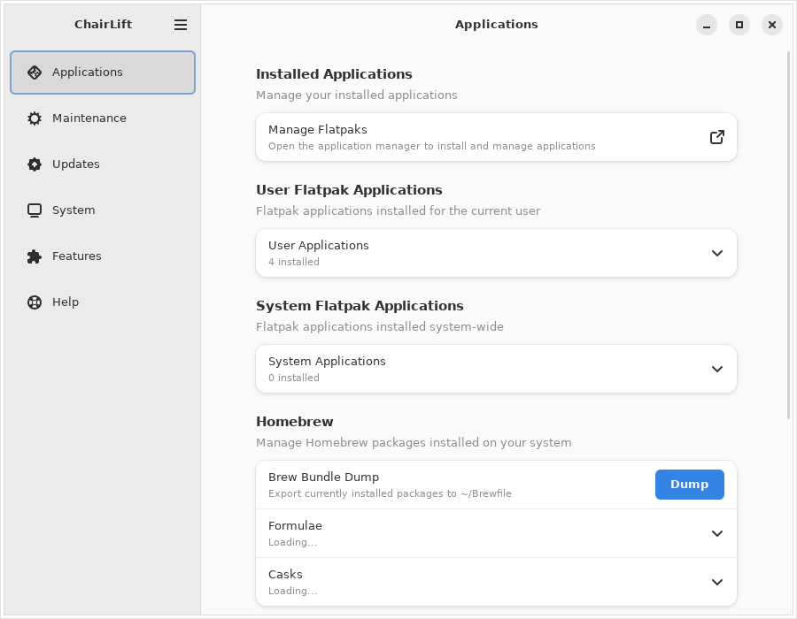
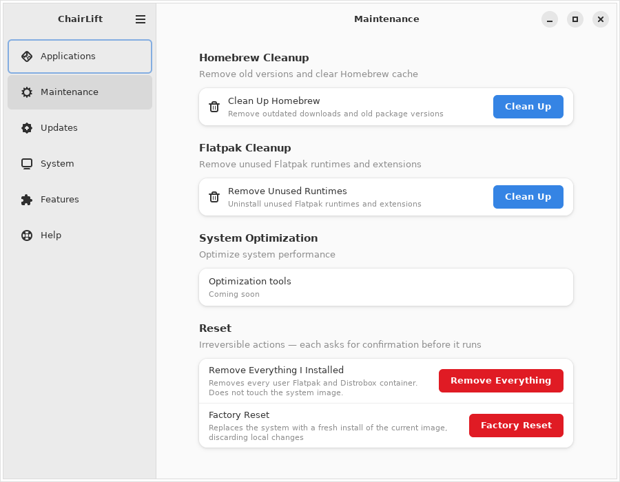
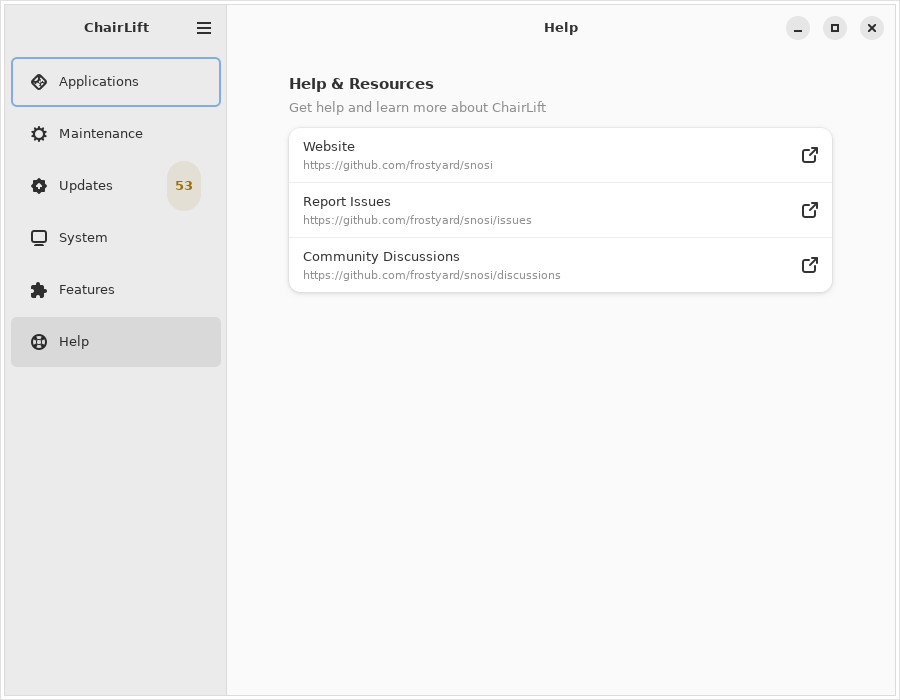

# ChairLift walkthrough

Every screen in ChairLift, captured from the real app by `make screenshots`
(see [below](#how-these-are-made)) — not mockups.

ChairLift covers Snow Linux and the Bluefin family (Bluefin, Bluefin LTS,
Dakota) from one app. Ported features from
[bluefinctl](https://github.com/projectbluefin/bluefinctl) and
[finupdate](https://github.com/tuna-os/finupdate) are simplified down to one
control per decision — no strategy pickers, no schedule choosers, no
feature-chip grids.

---

## Updates



**Update All** brings the OS image, Flatpak apps, and Homebrew packages up to
date in one click, with per-phase status and a desktop notification when it
finishes — the one operation long enough you might step away. A restart
prompt shows up only when an image was actually staged. **Automatic Updates**
is one switch for background updates. **Roll Back** (in System Updates, on
bootc hosts) is one row naming the previous deployment, and **What's
Changing** next to it compares the running and staged images package by
package — pulled from the images' own SBOMs, on request, since each side is
a large download.

> The System Updates group is absent from the screenshot above: it only
> appears on a bootc host, and the machine that captures these images is not
> one.

Below that, the per-provider Flatpak and Homebrew groups still work
independently if you just want to update one thing.

---

## System



Image and deployment status, plus two switches for which image you're
running: **Release Channel** (stable/testing) and **Graphics Driver**
(switches to the matching NVIDIA image when one's detected and published for
your stream). Both are hidden or shown inactive when there's genuinely
nothing to switch to — see [ADR-0011](adr/0011-chairlift-owns-bluefin-family-rebasing.md)
for why. `os-release` details and a Mission Center link round out the page.

---

## Features



**Developer Mode** joins the container/VM/serial-device groups — it does not
rebase you to a `-dx` image. **Gaming Mode** installs Steam, Proton tooling,
and a few extras as user Flatpaks, no admin password needed. **System
Features** below is Snow Linux's updex manager, empty elsewhere.

**Local AI** runs a language model in a rootless container on your own
hardware. ChairLift picks the image from the GPU it finds — CUDA, ROCm,
Intel, or CPU — so there is one switch rather than a catalog. The API is
served on `localhost:8080`; the first start downloads several GB.

---

## Applications



Installed Flatpaks and Homebrew formulae/casks, search across both, **Bundles**
for one-click package sets, and per-user tap trust for untrusted Homebrew
taps.

---

## Maintenance



Homebrew and Flatpak cleanup, plus any maintenance actions the image
maintainer configured. An optional **Reset** group (off by default) adds
Powerwash — remove every Flatpak and Distrobox container — and Factory
Reset, each behind a confirmation dialog since neither can be undone.

---

## Help



Links to the distribution's website, issues, and discussions.

---

## How these are made

```bash
make screenshots
```

Builds the app, runs it headless under Xvfb, navigates every page, and writes
one cropped PNG per page to `docs/screenshots/`. Always `--dry-run`, so
nothing on the capture machine actually changes. A few things the capture
host can't have (a Bluefin image, an NVIDIA GPU, an active update timer) are
supplied by stubs compiled only into the `chairlift_e2e` test build — no
released binary can read them, which `make ci` checks.

Screenshots aren't regenerated per-commit (font/theme drift would churn the
repo) — run `make screenshots` when a feature's appearance changes. `make ci`
does check that every page and configurable group has a screenshot and an
entry in this doc.
